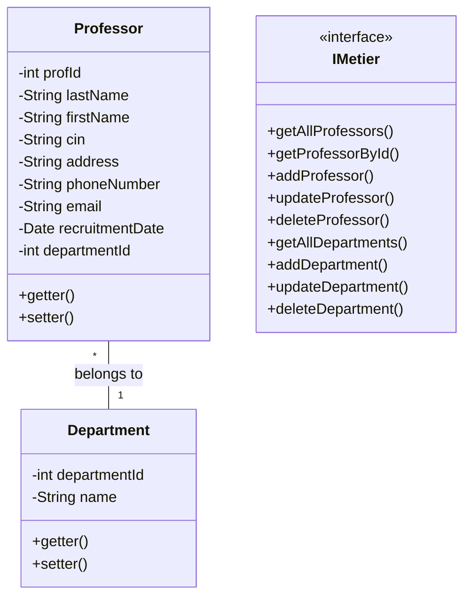

# University Management Project - Technical Documentation

## 1. Application Design - Class Diagram

### Objective
Create a UML class diagram representing the logical architecture of our university management application.

### Main Class Description
- **Professor**
  - Attributes: 
    - `profId` (int)
    - `lastName` (String)
    - `firstName` (String)
    - `cin` (String)
    - `address` (String)
    - `phoneNumber` (String)
    - `email` (String)
    - `recruitmentDate` (Date)
    - `departmentId` (int)

- **Department**
  - Attributes:
    - `departmentId` (int)
    - `name` (String)

### Class Diagram


> **Note**: Class diagram image to be added

## 2. Logical Data Model (LDM)

### Tables and Relations
1. **Professor Table**
   - `profId` (Primary Key)
   - `lastName`
   - `firstName`
   - `cin`
   - `address`
   - `phoneNumber`
   - `email`
   - `recruitmentDate`
   - `departmentId` (Foreign Key to Department)

2. **Department Table**
   - `departmentId` (Primary Key)
   - `name`

### Relational Schema
```
Professor (profId, lastName, firstName, cin, address, phoneNumber, email, recruitmentDate, #departmentId)
Department (departmentId, name)
```

> **Note**: LDM diagram to be added

## 3. MySQL Database Creation

### Table Creation Script
```sql
CREATE DATABASE IF NOT EXISTS university;
USE university;

CREATE TABLE IF NOT EXISTS Departement (
    id_deprat INT AUTO_INCREMENT PRIMARY KEY,
    nom VARCHAR(255) NOT NULL
);

CREATE TABLE IF NOT EXISTS Professeur (
    id_prof INT AUTO_INCREMENT PRIMARY KEY,
    nom VARCHAR(255) NOT NULL,
    prenom VARCHAR(255) NOT NULL,
    cin VARCHAR(20) UNIQUE NOT NULL,
    adresse VARCHAR(255),
    telephone VARCHAR(20),
    email VARCHAR(255) UNIQUE NOT NULL,
    date_recrutement DATE NOT NULL,
    id_deprat INT,
    FOREIGN KEY (id_deprat) REFERENCES Departement(id_deprat)
    ON DELETE SET NULL
    ON UPDATE CASCADE
);
```

## 4. Persistent Classes

### Professor Class
```java
public class Professor {
    private int profId;
    private String lastName;
    private String firstName;
    private String cin;
    private String address;
    private String phoneNumber;
    private String email;
    private Date recruitmentDate;
    private int departmentId;

    // Constructors, getters, setters
}
```

### Department Class
```java
public class Department {
    private int departmentId;
    private String name;

    // Constructors, getters, setters
}
```

## 5. IMetier Interface

### Interface Definition
```java
public interface IMetier {
    // Professor Operations
    List<Professor> getAllProfessors();
    Professor getProfessorById(int id);
    void addProfessor(Professor professor);
    void updateProfessor(Professor professor);
    void deleteProfessor(int profId);

    // Department Operations
    List<Department> getAllDepartments();
    Department getDepartmentById(int id);
    void addDepartment(Department department);
    void updateDepartment(Department department);
    void deleteDepartment(int departmentId);
}
```

## 6. Database Connection Singleton

### SingletonConnectionDB Class
```java
public class SingletonConnectionDB {
    private static Connection connection = null;
    private static final String URL = "jdbc:mysql://localhost:3306/UniversityDB";
    private static final String USER = "root";
    private static final String PASSWORD = "";

    private SingletonConnectionDB() {}

    public static Connection getConnection() {
        try {
            if (connection == null || connection.isClosed()) {
                connection = DriverManager.getConnection(URL, USER, PASSWORD);
            }
        } catch (SQLException e) {
            e.printStackTrace();
        }
        return connection;
    }
}
```

## 7. IMetier Interface Implementation

### MetierImpl Class
```java
public class MetierImpl implements IMetier {
    private Connection connection;

    public MetierImpl() {
        connection = SingletonConnectionDB.getConnection();
    }

    // Interface method implementations
    @Override
    public List<Professor> getAllProfessors() {
        // Professor retrieval logic
    }

    // Other similar methods...
}
```

## 8. Console Test Application

### Test Class
```java
public static void main(String[] args) {
    IMetier metier = new MetierImpl();
    Scanner scanner = new Scanner(System.in);

    // Main menu selection
    System.out.println("1 - professors");
    System.out.println("2 - departments");
    
    int choice = scanner.nextInt();

    // Branch based on user choice
    if (choice == 1) {
        // Professor operations CRUD
    } else if (choice == 2) {
        // Department operations CRUD
    }
}
```


## 9. JavaFX Application Architecture

### Architectural Overview
The application follows a comprehensive Model-View-Controller (MVC) pattern with a modular and layered approach, designed to provide a clean separation of concerns and maintainable codebase.

### Architectural Components

#### 1. View Layer (FXML)
The view layer is composed of multiple FXML files that define the user interface:

##### Main Interface
- **`Main.fxml`**: 
  - Serves as the primary container with tab-based navigation
  - Provides a unified entry point for the application
  - Manages overall application layout

##### Core Views
- **`ProfessorsView.fxml`**: Dedicated view for professor management
- **`DepartmentsView.fxml`**: Dedicated view for department management

##### Dialog Components
**Professor-related Dialogs**:
- **`AddProfessorDialog.fxml`**: Modal dialog for adding new professors

  

- **`UpdateProfessorDialog.fxml`**: Modal dialog for updating existing professor information

  


**Department-related Dialogs**:
- **`AddDepartmentDialog.fxml`**: Modal dialog for creating new departments

  

- **`UpdateDepartmentDialog.fxml`**: Modal dialog for modifying department details

  


#### 2. Controller Layer
The controller layer manages user interactions, data flow, and business logic:

##### Main Controller
- **`MainC.java`**: 
  - Coordinates top-level application navigation
  - Manages tab switching and overall application state

##### Core Tab Controllers
- **`ProfessorsC.java`**: Handles professor-specific interactions
- **`DepartmentsC.java`**: Manages department-related operations

##### Dialog Controllers
- **`AddProfessorDialogController.java`**: Manages the logic for adding new professors
- **`UpdateProfessorDialogController.java`**: Handles professor information updates
- **`AddDepartmentDialogController.java`**: Manages new department creation
- **`UpdateDepartmentDialogController.java`**: Handles department information modifications

#### 3. Model Layer
The model layer includes:
- `Professor` class
- `Department` class
- Business logic classes
- Data access objects (DAOs)
- Database interaction classes

### Key Design Principles

#### 1. Separation of Concerns
- Each FXML file represents a specific view
- Corresponding controllers manage the logic for each view
- Clear boundaries between presentation and business logic

#### 2. Modularity
- Distinct controllers for different functionalities
- Separate dialogs for add and update operations
- Easy to extend and maintain

#### 3. Flexibility
- Tab-based interface allows easy navigation
- Modal dialogs for detailed interactions
- Consistent user experience across different sections

### Main Features

#### 1. Professor Management
- Add new professors
- Update existing professor information
- View professor list
- Delete professors


#### 2. Department Management
- Create new departments
- Modify department details
- View department list
- Remove departments


#### 3. Advanced Functionality
- Search and filtering capabilities

  

- CRUD (Create, Read, Update, Delete) operations
- Validation and error handling
- Responsive and interactive UI


## Conclusion
This project demonstrates a comprehensive approach to management application development with Java, covering data persistence, user interface, and design best practices.
